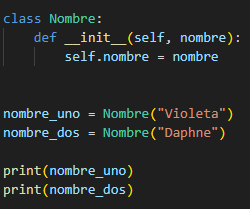
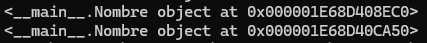
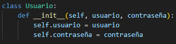

# Introducción al mundo del desarrollo

El material a continuación servirá para conocer conceptos del mundo de la programación. Este documento cuenta con explicaciones de los conceptos, ejemplos que pueden ser copiados, cambiados y ejecutados en una terminal de Python e imágenes que harán este proceso de aprendizaje algo mucho menos intimidante de lo que puede parecer a primera vista.

## 1) ¿Para qué usamos Clases en Python?
Las clases son una parte fundamental en el mundo de la programación. Las clases son objetos de Python en los que podemos encontrar datos, podemos encontrar comportamientos (funciones) o incluso podemos encontrarnos ambas cosas a la vez.

Usaremos clases en Python para tener el mismo comportamiento en múltiples lugares de nuestro código, al ser código que podemos llamar cuando necesitemos usarlo. Para usar clases en Python debemos instanciarlas primero (cosa que veremos en el ejemplo a continuación).

Una vez ejecutamos este código podemos ver (imagen a continuación) que con esto no estamos regresando los valores que le hemos pasado, ahora mismo estamos viendo el dunder \_\_main__, que es un método especial del que hablaremos más adelante.

Además de esto, podemos crear subclases que hereden el comportamiento de las clases de las que fueron creadas para tener código más específico.

## 2) ¿Qué método se ejecuta automáticamente cuando se crea una instancia de una clase?
En Python, cuando creamos una instancia de cualquier clase, el método \_\_init__ se creará y ejecutará automáticamente antes de ejecutar cualquier otro método. Este método se usa para procesar toda la información necesaria para poder usar la clase. Habitualmente usaremos el método \_\_init__ para añadir datos a la clase.

El primer argumento que le pasamos a \_\_init__ debe ser self. Además de self, \_\_init__ admite otros argumentos, cosa que veremos a continuación. La estructura que usaremos dentro de esta función debe ser self.argumento = argumento, de esta forma hacemos que argumento se refiera a la propia instancia.

## 3) ¿Cuáles son los tres verbos de API?
Hay múltiples métodos que usaremos cuando trabajemos con APIs. Los más comunes son GET, POST y DELETE.

### Método GET
El método GET nos permite recibir datos de la API sin sobrescribir nada en la aplicación. Estos datos estarán en formato JSON y se los podemos pasar a otras aplicaciones si así lo deseamos.

### Método POST
El método POST nos permite subir datos a la API para cambiar el estado actual. Éste método también se utiliza para efectos disparados del servidor como para que la API vuelva a mandar un correo de verificación, por ejemplo.

### Método DELETE
Por último, el método DELETE nos sirve para eliminar recursos del servidor/base de datos. Es muy importante tener cuidado a la hora de utilizar el método DELETE y una vez ejecutado, no encontraremos los objetos sobre los que estemos trabajando (al haberlos borrado).

## 4) ¿Es MongoDB una base de datos SQL o NoSQL?
Habitualmente nos encontramos con bases de datos SQL, donde los datos que manejamos en cada una de las diferentes tables que conforman nuestra base de datos deben ser consistentes, es decir, deben tener la misma cantidad de columnas con los mismos tipos de datos.

MongoDB, sin embargo, es una base de datos de tipo NoSQL. Esto quiere decir que no hay esquema, así que podemos almacenar grandes cantidades de datos y al hacerlo podemos insertar cualquier nombre de columna o cualquier clave. Por ejemplo, los dos inserts a continuación no causarán errores en MongoDB.

Estos dos inserts (que habrán funcionado correctamente sin errores) nos causan el problema de que ahora tendremos datos dentro de “password” y dentro de “key” por error a la hora de introducir datos, en vez de tener todos estos datos en un solo sitio. Esta es una responsabilidad que tenemos a la hora de programar el código: debemos conocerlo íntimamente para no causar problemas en el futuro.

## 5) ¿Qué es una API?
API es el acrónimo de Aplication Programming Interface, que es una manera de comunicarnos con una aplicación. A pesar de tener la forma de un enlace, las APIs con las que trabajemos nos devolverán datos en forma de ficheros JSON en vez de páginas web. Estos archivos JSON los podemos pasar a otras aplicaciones para que usen esos datos. Con esto conseguimos que diferentes aplicaciones se comuniquen entre ellas.

En el mundo de la programación moderno es muy común trabajar con APIs. Podemos esperar que todos los servicios grandes que encontremos tengan su propia API por lo que familiarizarnos con la documentación es de vital importancia. A continuación encontrarás una lista de enlaces con más información en caso de que quieras trabajar con estas APIs.

https://developers.google.com/youtube/v3?hl=es-419

https://developer.twitter.com/

https://developers.facebook.com/products/instagram/apis/

https://core.telegram.org/

## 6) ¿Qué es Postman? 
Postman es un programa que nos permite interactuar con APIs, que en vez de devolvernos páginas web nos devuelven datos. Una de las fortalezas de Postman es que es totalmente agnóstico al entorno. Podemos usarlo cuando estemos trabajando con Python y también podemos usarlo cuando trabajemos con otros lenguajes de programación y con otros frameworks.

Usar Postman es tan sencillo como pegar el enlace a la API que queramos usar en el programa, seleccionar el método que queremos usar (hay varias opciones, como GET, POST o DELETE, pero la API nos informará de cuál debemos usar para nuestros propósitos) y darle al botón “Send”. A continuación vemos el JSON resultante de usar el método GET con la API de https://jsonplaceholder.typicode.com

Esta es una forma mucho más cómoda de trabajar que tratar de usar un navegador web ya que el formato de los datos JSON es mucho más legible.

## 7) ¿Qué es el polimorfismo?
Hay ocasiones en las no queremos que las clases de nuestro código sean accesibles al usuario (por motivos que pueden ser de logística, de seguridad, etc) y sin embargo, queremos tener ese comportamiento en nuestro código. Para ello el polimorfismo es la herramienta ideal.

En nuestra clase que no queremos accesible al usuario podemos crear el siguiente método:

Una vez creado éste método, todas podemos crear las subclases necesarias que hereden la clase que no queremos accesible al usuario. Estas clases que pueden ser llamadas pueden acceder al método que sea necesario y ejecutarlo, ya que estas clases heredan todos los comportamientos de las clases desde las que se crean. Sin embargo, si se da el caso que estas subclases no pueden acceder a este método (render en el ejemplo) entonces veremos un error en la consola y podemos pasar a corregir el bug.

## 8) ¿Qué es un método dunder?
Los métodos “dunder” son los métodos que empiezan y acaban con dos guiones bajos. Ejemplos de métodos dunder son \_\_init__ (que hemos visto anteriormente), \_\_str__ o \_\_repr__. Los métodos dunder son equivalentes a los métodos privados o protegidos que podemos encontrar en otros lenguajes de programación.

Los métodos dunder son métodos que existen directamente en el lenguaje Python. No son métodos de terceros ni métodos que nosotras hayamos creado. Por lo tanto, no debemos tratar de sobrescribir estos métodos.

Los métodos dunder pueden coger múltiples argumentos, aunque siempre le pasaremos self como primer argumento. Si le pasamos más de un argumento, dentro del método querremos asignar esos valores a la propia instancia del método usando el mismo código que hemos visto en el segmento donde hablamos de \_\_init__.

En los métodos dunder podemos tener código tan sencillo como el que vemos a continuación (en la siguiente imagen) o código tan complejo como vimos anteriormente (en el punto dos).

Ejecutamos este código sencillo que cuenta con \_\_str__:

Esto da como resultado el siguiente print por pantalla:

## 9) ¿Qué es un decorador de Python?
Tal y como hemos hablado, las clases en Python pueden acceder a los valores que tenemos en nuestro código. Esto se puede considerar una mala práctica en ciertos círculos porque aunque acceder a los valores es lo que nos permite trabajar con ellos, sacarlos por pantalla y hacer lo que necesitemos con ellos, también podemos sobrescribirlos si no tenemos cuidado. Por este motivo, los decoradores son una de las partes más importantes de Python.

Para proteger los valores usaremos decoradores. La forma que estos decoradores toman es que cambiaremos self.usuario = usuario por self._usuario = usuario. Esto es por convención para decir que esto está protegido y podemos esperar esta sintaxis de la mayoría de programadores.

Después pondremos el siguiente segmento en nuestro código para hacer esa variable de usuario accesible. De esta forma podemos trabajar con esta variable pero hacemos que sea segura no permitiendo que le escribamos encima sin querer.

Como vemos en el ejemplo anterior, podemos hacer esto con cada argumento que le pasamos a la función. Si más adelante queremos sobrescribir la variable podemos escribir el siguiente código:

Esto nos permite pasarle un valor a la función que estamos usando como es habitual, pero además ahora podemos reasignar el valor del usuario.