# Introducción al mundo del desarrollo

El material a continuación servirá para conocer conceptos del mundo de la programación. Este documento cuenta con explicaciones de los conceptos, ejemplos que pueden ser copiados, cambiados y ejecutados en una terminal de Python e imágenes que harán este proceso de aprendizaje algo mucho menos intimidante de lo que puede parecer a primera vista.

## 1) ¿Para qué usamos Clases en Python?
Las clases son una parte fundamental en el mundo de la programación. Las clases en Python nos permiten crear planos con objetos. Las clases pueden tener datos y comportamientos en ellas. Usaremos clases en Python para tener el mismo comportamiento en múltiples lugares de nuestro código, al ser código que podemos llamar cuando necesitemos usarlo.

La sintaxis para una de las clases más simple posible es:
class Usuarios:
    def saludo(self):
        return "Hola, buenos días."

Es importante pasarle siempre "self" como el primer argumento a las clases en Python. Para llamar a esta clase debemos instanciarla. La instanciación es el proceso de crear un objeto con esta clase, para lo que ejecutamos el siguiente código:

    class Usuarios:
        def saludo(self):
            return "Hola, buenos días."

    usuario_uno = Usuarios()
    print(usuario_uno)

Si ejecutamos este pequeño segmento de código python nos encontraremos con que nos devuelve el siguiente código.

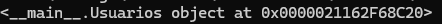

Este \_\_main__ es un método especial de nombre main que veremos a continuación. Imprimir esto por pantalla nos señala dónde está la instancia de la clase que hemos creado en la memoria. Si instanciamos la clase de nuevo con

    usuario_uno = Usuarios()
    print(usuario_uno)

Entonces las dos instancias ocupan dos espacios en memoria.
Podemos hacer    print(usuario_uno.saludo()) para ver el return del método saludo.

También podemos tener clases más complejas, que es lo que sucederá en el mundo real. El siguiente esquema ejemplifica el código que veremos a continuación (en la 2ª cuestión), en el que tenemos una serie de habitaciones en nuestro hotel.

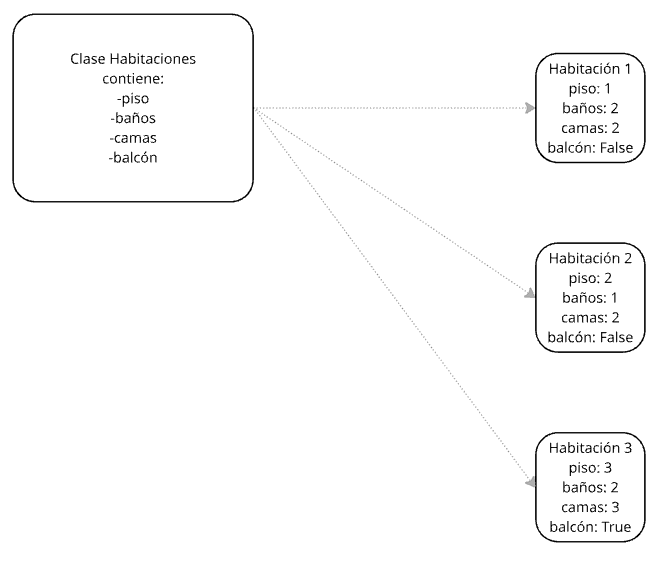
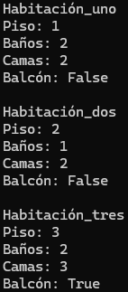

## 2) ¿Qué método se ejecuta automáticamente cuando se crea una instancia de una clase? ta guay
Las clases de Python se componen de datos y de comportamiento. El comportamiento de las clases está governado por funciones. Python maneja los datos de forma diferente al resto de lenguajes de programación. Estaremos usando una función especial del propio lenguaje de programación Python que se llama \_\_init__. La forma en la que las funciones constructoras (como ésta) funcionan es que se las llama automáticamente cuando instanciamos la clase. Cuando creamos un habitacion_uno Python buscar la función \_\_init__ y procesa lo que contenga. La importancia de éste método que se ejecuta automáticamente es que, de esta forma, podemos disponer de todas las variables y datos que necesitemos para trabajar con esa clase inmediatamente. El primer argumento que le pasaremos será self porque todas las funciones que estén dentro de una clase en Python necesitan ese primer argumento self para poder referirse a sí mismas. Después de self podemos pasarle más argumentos si la función los necesita.

Con estos argumentos que le pasamos podemos añadirle datos directamente a esta clase. La forma de hacer esto con el ejemplo que vemos a continuación es con self.piso = piso. Ésta sintaxis es diferente a la sintaxis de otros lenguajes de programación y por ello puede resultar extraña a quien tenga experiencia previa. La razón por la que la sintaxis toma esta forma es porque todos los ítems en Python son objetos. Cuando instanciemos la clase con la que trabajamos queremos que los datos que le pasamos a esa función se asignen a esa instancia de la clase, a ese nuevo objeto de Python. Con este código estamos creando cuatro variables que están enlazadas directamente con la instancia particular de la clase. Ésta es la forma en la que le asignamos esos valores a esa instancia de la clase.

    class Habitaciones:
        def __init__(self, piso, baños, camas, balcón):
            self.piso = piso
            self.baños = baños
            self.camas = camas
            self.balcón = balcón
        
        def formatter(self):
            return f"Las condiciones de la habitación son las siguientes. Piso: {self.piso}. Baños: {self.baños}. Camas: {self.camas}. Balcón: {self.balcón}."
    
    habitación_uno = Habitaciones(1, 2, 2, False)
    habitación_dos = Habitaciones(2, 1, 2, False)
    habitación_tres = Habitaciones(3, 2, 3, True)
    
    print(habitación_uno.formatter())
    print(habitación_dos.formatter())
    print(habitación_tres.formatter())
    
    print("Habitación_uno")
    print(f"Piso: {habitación_uno.piso}")
    print(f"Baños: {habitación_uno.baños}")
    print(f"Camas: {habitación_uno.camas}")
    print(f"Balcón: {habitación_uno.balcón}")
    
    print("\nHabitación_dos")
    
    print(f"Piso: {habitación_dos.piso}")
    print(f"Baños: {habitación_dos.baños}")
    print(f"Camas: {habitación_dos.camas}")
    print(f"Balcón: {habitación_dos.balcón}")
    
    print("\nHabitación_tres")
    
    print(f"Piso: {habitación_tres.piso}")
    print(f"Baños: {habitación_tres.baños}")
    print(f"Camas: {habitación_tres.camas}")
    print(f"Balcón: {habitación_tres.balcón}")

Hemos creado una clase de nombre Habitaciones. Hemos creado una función constructor con \_\_init__. Le hemos pasado self para tener acceso a cada instancia de la clase. Después le pasamos piso, baños, camas y balcón como argumentos. Entonces le asignamos esos argumentos al objeto con self.piso = piso, self.baños = baños, etc. Le estamos diciendo al programa que cree una variable dentro del objeto, que se llame pisos y que tenga el valor que le pasamos. Hacemos lo mismo para el resto de argumentos. Por último la función formatter nos devuelve un string con las condiciones de la habitación a través de las sentencias self. En lugar de formatter es posible darle cualquier otro nombre a éste método, pero darle un nombre claro ayuda a entender su propósito.

## 3) ¿Cuáles son los tres verbos de API?
Hay múltiples métodos que usaremos cuando trabajemos con APIs. Los más comunes son GET, POST, PUT y DELETE, que forman las operaciones CRUD. CRUD viene de las iniciales de Create, Read, Update y Delete.

### Método GET
El método GET nos permite recibir datos de la API sin sobrescribir nada en la aplicación. Estos datos estarán en formato JSON y se los podemos pasar a otras aplicaciones si así lo deseamos.

### Método POST
El método POST nos permite subir datos a la API para cambiar el estado actual. Éste método también se utiliza para efectos disparados del servidor como para que la API vuelva a mandar un correo de verificación, por ejemplo.

### Método PUT
El método PUT nos permite actualizar los contenidos de datos que ya existen en el servidor. A diferencia del método POST, PUT no debe usarse para crear datos nuevos, pero si el dato existe y lo que queremos hacer es renovarlo, PUT es el método ideal.

### Método DELETE
Por último, el método DELETE nos sirve para eliminar recursos del servidor/base de datos. Es muy importante tener cuidado a la hora de utilizar el método DELETE y una vez ejecutado, no encontraremos los objetos sobre los que estemos trabajando (al haberlos borrado).

## 4) ¿Es MongoDB una base de datos SQL o NoSQL?
Habitualmente nos encontramos con bases de datos SQL, donde los datos que manejamos en cada una de las diferentes tables que conforman nuestra base de datos deben ser consistentes, es decir, deben tener la misma cantidad de columnas con los mismos tipos de datos.

MongoDB, sin embargo, es una base de datos de tipo NoSQL. Esto quiere decir que no hay esquema, así que podemos almacenar grandes cantidades de datos y al hacerlo podemos insertar cualquier nombre de columna o cualquier clave. Por ejemplo, los dos inserts a continuación no causarán errores en MongoDB.

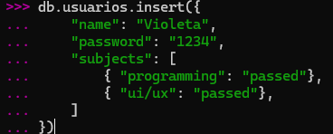

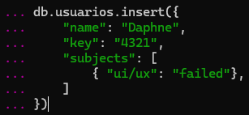

Estos dos inserts (que habrán funcionado correctamente sin errores) nos causan el problema de que ahora tendremos datos dentro de “password” y dentro de “key” por error a la hora de introducir datos, en vez de tener todos estos datos en un solo sitio. Esta es una responsabilidad que tenemos a la hora de programar el código: debemos conocerlo íntimamente para no causar problemas en el futuro.

## 5) ¿Qué es una API?
API es el acrónimo de Aplication Programming Interface, que es una manera de comunicarnos con una aplicación. A pesar de tener la forma de un enlace, las APIs con las que trabajemos nos devolverán datos en forma de ficheros JSON en vez de páginas web. Estos archivos JSON los podemos pasar a otras aplicaciones para que usen esos datos. Con esto conseguimos que diferentes aplicaciones se comuniquen entre ellas.

Flujo de Request-Response
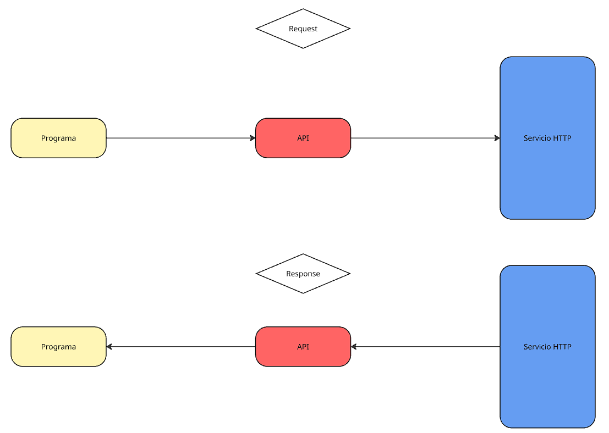

En el mundo de la programación moderno es muy común trabajar con APIs. Podemos esperar que todos los servicios grandes que encontremos tengan su propia API por lo que familiarizarnos con la documentación es de vital importancia.

### Tipos de APIs
#### Restful APIs (representational state transfer)
Las APIs RESTful usan protocolos HTTP para ejecutar operaciones con URLs y utilizan la arquitectura cliente-servidor común de los protocolos HTTP. El cliente realiza la petición HTTP y el servidor responde con datos en formato JSON. Las APIs RESTful son simples, tiene con buena escalabilidad y son de las más comunes en servicios web. Ejemplos de este tipo de APIs son Google, Twitter (actualmente X), Facebook o Telegram, para los cuales tenemos más documentación en sus webs.

https://developers.google.com/youtube/v3?hl=es-419

https://developer.twitter.com/

https://developers.facebook.com/products/instagram/apis/

https://core.telegram.org/

#### SOAP APIs (simple object access protocol)
Las APIs de tipo SOAP utilizan el protocolo SOAP para intercambiar datos en formato XML, que define la estructura del formato de los mensajes, de cómo manejamos errores y la forma en la que se desarrollará la comunicación entre aplicaciones. Las APIs SOAP se utilizan habitualmente en aplicaciones a nivel empresarial y utiliza estructuras más rígidas que las APIs RESTful. Ejemplos de APIs SOAP incluyen Microsoft 365 o Amazon Web Services.

### Códigos de estado HTTP
Las peticiones API que realicemos generarán códigos de respuesta HTTP. Por ello, es importante tener cierta familiaridad con estos códigos. Las respuestas se agrupan en cinco grupos diferentes. Aún si los códigos de retorno que obtenemos no son los más comunes (que veremos a continuación), sabes en qué categoría se encuentra el código es importante a la hora de debuggar.

Códigos 100 -> 199: Respuesta informativa  
Códigos 200 -> 299: Respuesta satisfactoria  
Códigos 300 -> 399: Redirección  
Códigos 400 -> 499: Error del cliente  
Códigos 500 -> 599: Error del servidor  

Código 200: OK. La solicitud ha funcionado correctamente.  
Cçodigo 201: Created. Este código significa que la solicitud ha funcionado y que ha creado un recurso nuevo. Es el código que esperamos recibir tras usar el método PUT.  
Código 300: Multiple choice. La solicitud que hemos mandado tiene más de una posible respuesta.  
Código 301: Moved permanently. La URI del recurso solicitado ha cambiado.  
Código 304: Not modified. El recurso no se ha modificado. Este código se utiliza en lo relacionado con cachés.  
Código 400: Bad request. El servidor no ha podido interpretar la solicitud realizada debido a sintaxis no válida.  
Código 403: Forbidden. Este código significa que no tenemos autenticación para el recurso solicitado.  
Código 404: Not found. El servidor no ha encontrado el recurso solicitado.  
Código 408: Request timeout. El servidor quiere desconectar la conexión. Es un código muy usado en navegadores como Chrome o Firefox.  
Código 500: Internal server error. El servidor ha encontrado un error inesperado.  
Código 502: Bad gateway. La puerta de enlace que el servidor esperaba no dio una respuesta válida.  
Código 503: Service unavailable. Es común encontrar este código de estado cuando el servidor está temporalmente caído o en mantenimiento.  

### Beneficios de usar APIs
Si bien es claro que la inmensa mayoría de aplicaciones grandes usar la tecnología API, es posible que en este punto no tengamos exactamente claro cuáles son los beneficios de esta tecnología. Los principales beneficios de usar APIs son:

#### Vínculos entre sistemas
Gracias a las APIs podemos conectarnos a diferentes sistemas y servidores, de forma que podemos comunicarnos con cosas como bancos o sistemas de pago.

#### Seguridad
Un puñado de las funciones de nuestro código se pueden mover a APIs separadas del programa principal, haciendo que acceder a datos que no queremos enseñar sea más difícil.

#### Reducir costes
Usar APIs ayuda a reducir costes y a ahorrar tiempo en el desarrollo de software.

### Buenas prácticas
A la hora de trabajar con APIs siempre querremos tomar las mejores prácticas posibles. Proteger nuestra API con autenticación es importante, así como usar los métodos HTTP adecuados en cada momento. GET es para recuperar datos, POST para crear datos nuevos, PUT para actualizar datos ya existentes y DELETE para elimiarlos; y es así como debemos usarlos. Por último, es también una buena practica la de crear un registro para nuestra API de forma que podamos detectar problemas y corregirlos lo antes posible.

## 6) ¿Qué es Postman?
Con la tecnología API podemos comunicarnos con otras aplicaciones. Podemos hacer esto sin hacer web-scraping gracias a Postman para comunicarnos con otra aplicación en otro servidor. Las APIs con ofrecen un conjunto de endpoints, que toman forma de URLs. Los datos que obtendremos de esos endpoints tienen forma de datos JSON, que a los humanos de carne y hueso nos cueta leer a simple vista, pero que una aplicación puede usar sin problemas. Si queremos crear una aplicación podemos usar Postman para comunicarnos con un servidor, obtener todos los datos necesarios, procesarlos y leerlos en pantalla.

Estrictamente hablando, podríamos pegar la URL de la API que queramos usar en un navegador, pero lo que veríamos sería complicado de procesar. Sería algo como esto.

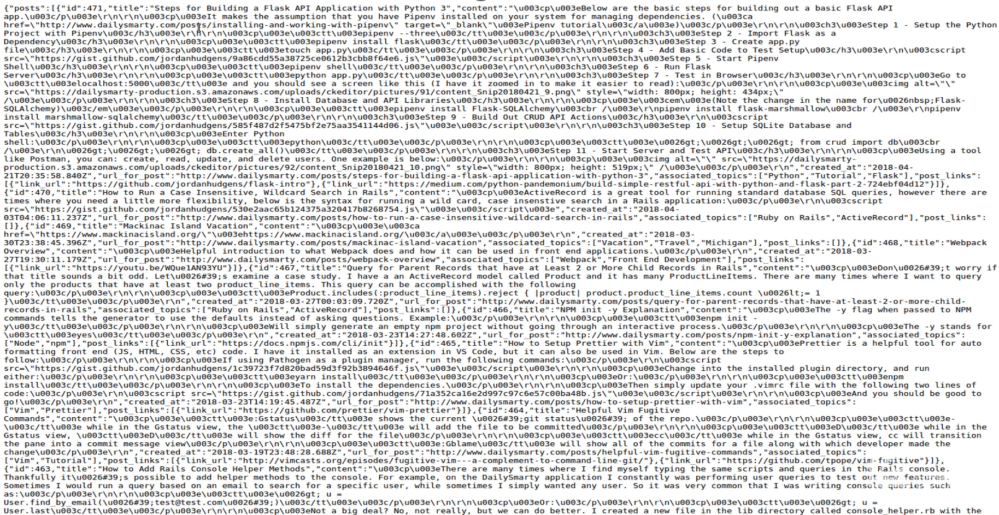

Sin embargo, gracias a herramientas como Postman, podemos obtener todos esos datos en forma de JSON y usarla para comunicarnos con la API con la que trabajamos.

Hay múltiples verbos HTTP, como hemos visto en el 3º punto. Para usar Postman querremos comprobar la documentación de la API con la que trabajaremos, ya que ahí estará disponible toda la información necesaria para saber cuál de estos verbos debemos usar. Si, por ejemplo, la documentación habla de usar la solicitud GET, usaremos ese método en nuestra consulta para obtener datos del servidor.

Para el siguiente ejemplo no usaremos autenticación, aunque es importante saber que en aplicaciones grandes es habitual querer usarla. A continuación vemos cómo usar Postman para realizar una consulta GET.

Cómo usar Postman 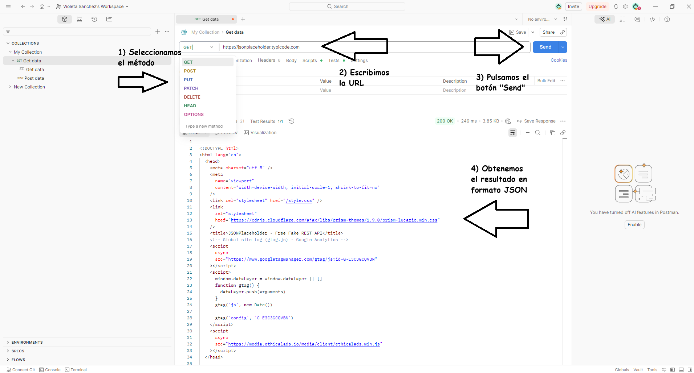

Una vez que pulsemos el botón "send", Postman se comunicará con el enlace que le facilitamos y seremos capaces de ver el resultado de la consulta GET que hemos solicitado. Postman obtendrá esta respuesta en tiempo real de la aplicación a la que apuntamos.

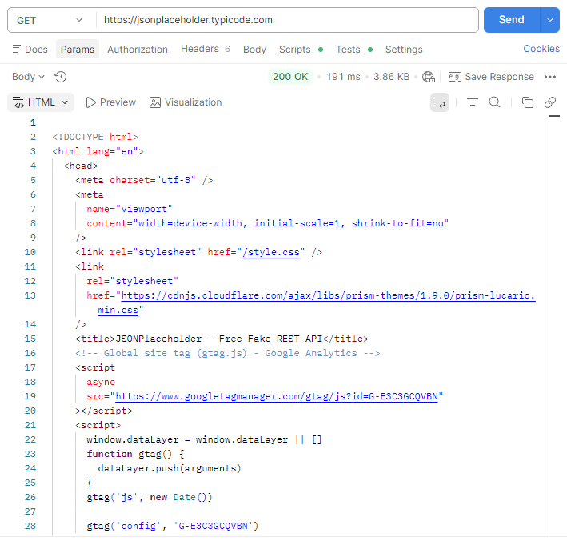

Es importante saber que además de poder apuntar a una aplicación online, gracias a Postman también podemos apuntar a localhost si tenemos un servidor configurado y ejecutándose en la máquina en la que estamos trabajando. Esto puede resultarnos muy interesante en caso de que estemos desarrollando una aplicación, ya que nos permite realizar cambios rápidos y testearlos sin necesidad de desplegar cada pequeño cambio.

Además, Postman dispone de un agente de chat AI que podemos usar si así lo deseamos. 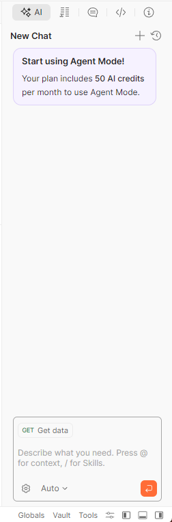

## 7) ¿Qué es el polimorfismo?
Hay ocasiones en las no queremos que las clases de nuestro código sean accesibles al usuario (por motivos que pueden ser de logística, de seguridad, etc) y sin embargo, queremos tener ese comportamiento en nuestro código. Para ello el polimorfismo es la herramienta ideal.

En nuestra clase que no queremos accesible al usuario podemos crear el siguiente método:

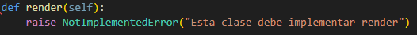

Una vez creado éste método, todas podemos crear las subclases necesarias que hereden la clase que no queremos accesible al usuario. Estas clases que pueden ser llamadas pueden acceder al método que sea necesario y ejecutarlo, ya que estas clases heredan todos los comportamientos de las clases desde las que se crean. Sin embargo, si se da el caso que estas subclases no pueden acceder a este método (render en el ejemplo) entonces veremos un error en la consola y podemos pasar a corregir el bug.****bunch of images here. spam the f~ out of it

## 8) ¿Qué es un método dunder?
Los métodos “dunder” son los métodos que empiezan y acaban con dos guiones bajos. De hecho, de ahí sacan su nombre, ya que en inglés nos encontraremos con dos guiones bajos, '*D*ouble *UNDER*score' seguido del nombre del método, como por ejemplo init, y después seguido de otros dos guiones bajos. Ejemplos de métodos dunder son \_\_init__ (que hemos visto anteriormente), \_\_str__ o \_\_repr__. Los métodos dunder son equivalentes a los métodos privados o protegidos que podemos encontrar en otros lenguajes de programación.

Los métodos dunder son métodos que existen directamente en el lenguaje Python. No son métodos de terceros ni métodos que nosotras hayamos creado. Por lo tanto, no debemos tratar de sobrescribir estos métodos.

Los métodos dunder pueden coger múltiples argumentos, aunque siempre le pasaremos self como primer argumento. Si le pasamos más de un argumento, dentro del método querremos asignar esos valores a la propia instancia del método usando el mismo código que hemos visto en el segmento donde hablamos de \_\_init__.

En los métodos dunder podemos tener código tan sencillo como el que vemos a continuación (en la siguiente imagen)... 
Ejecutamos este código sencillo que cuenta con \_\_str__:

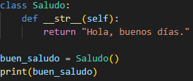

Esto da como resultado el siguiente print por pantalla:

O puede ser código tan complejo como el visto anteriormente:

    class Habitaciones:
        def __init__(self, piso, baños, camas, balcón):
            self.piso = piso
            self.baños = baños
            self.camas = camas
            self.balcón = balcón
    
        def formatter(self):
            return f"Las condiciones de la habitación son las siguientes. Piso: {self.piso}. Baños: {self.baños}. Camas: {self.camas}. Balcón: {self.balcón}."

    habitación_uno = Habitaciones(1, 2, 2, False)
    habitación_dos = Habitaciones(2, 1, 2, False)
    habitación_tres = Habitaciones(3, 2, 3, True)

    print(habitación_uno.formatter())
    print(habitación_dos.formatter())
    print(habitación_tres.formatter())

    print("Habitación_uno")
    print(f"Piso: {habitación_uno.piso}")
    print(f"Baños: {habitación_uno.baños}")
    print(f"Camas: {habitación_uno.camas}")
    print(f"Balcón: {habitación_uno.balcón}")

    print("\nHabitación_dos")

    print(f"Piso: {habitación_dos.piso}")
    print(f"Baños: {habitación_dos.baños}")
    print(f"Camas: {habitación_dos.camas}")
    print(f"Balcón: {habitación_dos.balcón}")

    print("\nHabitación_tres")

    print(f"Piso: {habitación_tres.piso}")
    print(f"Baños: {habitación_tres.baños}")
    print(f"Camas: {habitación_tres.camas}")
    print(f"Balcón: {habitación_tres.balcón}")

Una cosa importante a saber cuando trabajemos con métodos dunder es que no debemos implementar nuestros propios métodos dunder, así como también es buena práctica el implementar un "NotImplemented" para que podamos capturar las ejecuciones inesperadas.

## 9) ¿Qué es un decorador de Python?
Tal y como hemos hablado, las clases en Python pueden acceder a los valores que tenemos en nuestro código. Esto se puede considerar una mala práctica en ciertos círculos porque aunque acceder a los valores es lo que nos permite trabajar con ellos, sacarlos por pantalla y hacer lo que necesitemos con ellos, también podemos sobrescribirlos si no tenemos cuidado. En otros lenguajes de programación existe la idea de las clases privadas. Python, sin embargo, no tiene una traducción 1:1 de esta idea. Sin embargo, gracias a los decoradores podemos crear una buena impresión de una clase privada o de un método privado. Por este motivo, los decoradores son una de las partes más importantes de Python.

Para proteger los valores usaremos decoradores. De esta forma los valores que contienen estas variables no podrá sobrescribirse por accidente en el futuro. La forma que estos decoradores toman es la siguiente: que cambiaremos self.usuario = usuario por self._usuario = usuario. 

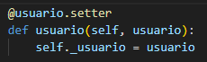

Esto es por convención para decir que usuario ahora está protegido y podemos esperar ésta sintaxis de la mayoría de programadores.

Después pondremos el siguiente segmento en nuestro código para hacer esa variable de usuario accesible. De esta forma podemos trabajar con esta variable pero hacemos que sea segura no permitiendo que le escribamos encima sin querer.

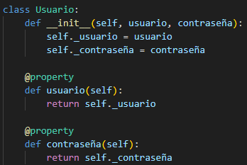

Como vemos en el ejemplo anterior, podemos hacer esto con cada argumento que le pasamos a la función. Si más adelante queremos sobrescribir la variable podemos escribir el siguiente código:

Esto nos permite pasarle un valor a la función que estamos usando como es habitual, pero además ahora podemos reasignar el valor del usuario.

Los usos más comunes de decoradores en Python son las de implementar autenticación, sistemas de login y caché.

Además de eso gracias a los decoradores podremos ampliar el uso de la clase original sin temor a modificarla y podremos separar los diferentes sistemas unos de otros.